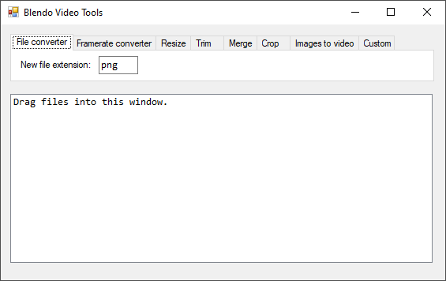

# Blendo Video Tools
 

## About
This is a very basic gui for FFmpeg:

Functionality includes:
- converting file types.
- converting to a new framerate.
- resizing to a new width/height.
- trimming a video shorter.
- joining multiple videos together.
- crop a video.
- convert images into a video.

This is written in C# and a .sln solution for Visual Studio 2015 is provided. Windows only.

If you want to download and use it, the tool is [available here](https://blendogames.itch.io/blendo-video-tools).

## Notes
- Contrary to the name, this tool can also be used on still images (PNG, JPG, etc) and audio (WAV, OGG, etc), not just videos.
- The specific arguments used can be customized by editing the args_*.txt files.
- It will output a file with a date timestamp appended to the filename.

## Installation
Download [FFMPEG](https://www.ffmpeg.org/download.html) and place ffmpeg.exe in the same folder as this program.

## License
This source code is licensed under the MIT license.

## Credits
- by [Brendon Chung](https://blendogames.com)

## Libraries used
- [FFMPEG](https://ffmpeg.org)
