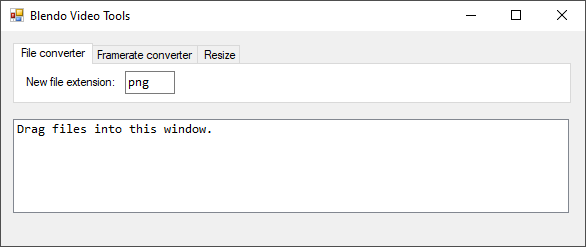

# Blendo Video Tools

## About
This is a very basic gui for FFMPEG:

Functionality includes:
- converting file types.
- converting to a new framerate.
- resizing to a new width/height.

This is written in C# and a .sln solution for Visual Studio 2015 is provided. Windows only.

If you want to download and use it, the tool is [available here](https://github.com/blendogames/blendovideotools/releases/tag/release).

## Notes
- This tool can also be used on still images (PNG, JPG, etc) and audio (WAV, OGG, etc), not just video.
- The specific arguments used can be customized by editing the args_*.txt files.
- It will output a file with a date timestamp appended to the filename.

## Installation
Download [FFMPEG](https://www.ffmpeg.org/download.html#build-windows) and place ffmpeg.exe in the same folder as this program.

## License
This source code is licensed under the MIT license.

## Credits
- by [Brendon Chung](https://blendogames.com)

## Libraries used
- [FFMPEG](https://ffmpeg.org)
